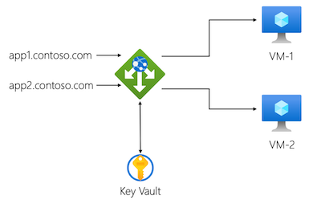

# Application Gateway with mulitple sites

This sample illustrates how to deploy an Azure Application Gateway instance with multiple sites. The sample deploys two virtual machines configured as web servers, and then deploys an application gateway that routes traffic to one site to the first virtual machine, and traffic for the other site to the second virtual machine:

It deploys a virtual network for the virtual machines and application gateway to use.

The sample shows how to use a single wildcard SSL/TLS certificate for both sites. The certificate and its password are stored in Key Vault secrets and uses Bicep key vault references.

### Notes

- It's generally good practice to keep your SSL certificates in a separate key vault, and refer to them from within the deployment. For simplicity, this sample creates the key vault and secret in the same Bicep file as it uses them.
- This sample assumes you use the same wildcard SSL certificate for both sites.
- Health probes aren't used in this sample.
